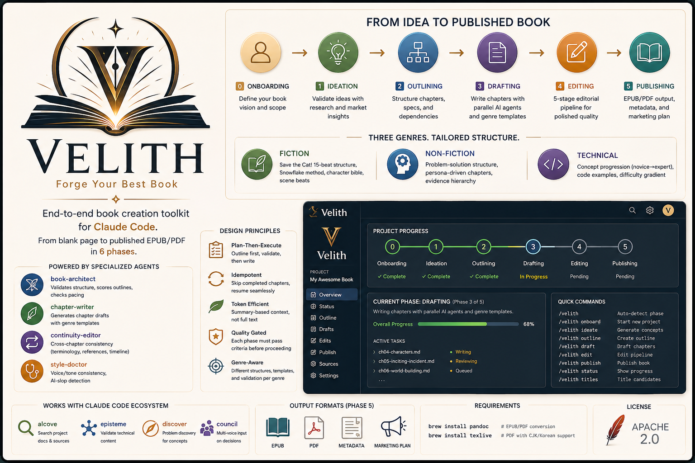
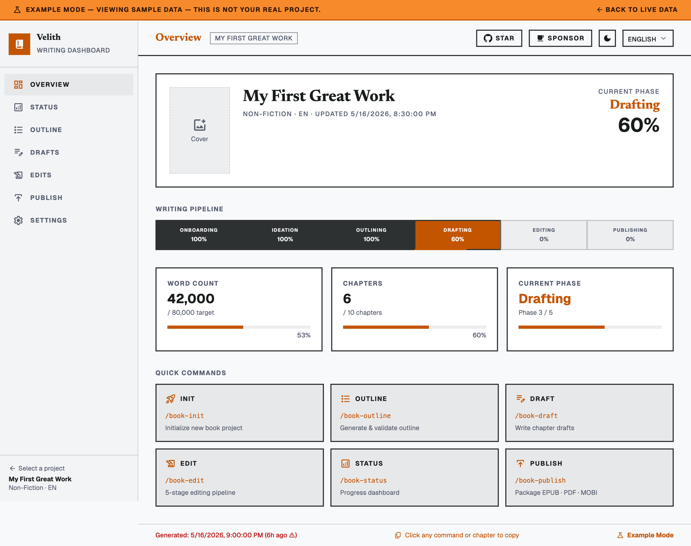

<div align="center">

# Velith

<p>
  <a href="https://github.com/epicsagas/Velith/stargazers"></a>
  <a href="https://github.com/epicsagas/Velith/network/members"></a>
  <a href="https://github.com/epicsagas/Velith/issues"></a>
  <a href="https://github.com/epicsagas/Velith/commits/main"></a>
</p>
<p>
  <a href=".claude-plugin/plugin.json"></a>
  <a href="LICENSE"></a>
  <a href="https://claude.ai/code"></a>
  <a href="https://github.com/openai/codex"></a>
  <a href="https://buymeacoffee.com/epicsaga"></a>
</p>
<p>
  <a href="docs/i18n/README.ko.md">한국어</a> ·
  <a href="docs/i18n/README.ja.md">日本語</a> ·
  <a href="docs/i18n/README.zh-Hans.md">中文</a> ·
  <a href="docs/i18n/README.es.md">Español</a> ·
  <a href="docs/i18n/README.fr.md">Français</a> ·
  <a href="docs/i18n/README.de.md">Deutsch</a> ·
  <a href="docs/i18n/README.pt-BR.md">Português</a>
</p>

**Build books like software.** AI-native publishing system for structured long-form creation — from blank page to publishable EPUB/PDF.

`Phase 0: Onboarding → Phase 1: Ideation → Phase 2: Outlining → Phase 3: Drafting → Phase 4: Editing → Phase 5: Publishing`

</div>



## Why Velith?

Writing a book with raw LLM prompts gives you disconnected chapters, inconsistent voice, and no structure. Velith treats books as **structured artifacts — not isolated prompts**. Each phase builds on persistent context to create coherent long-form work, with quality gates at every stage.

| | Feature | Why it matters |
|--|---------|----------------|
| 📋 | 6-phase pipeline | Each phase validates before moving on — no rework |
| 📖 | 7 genre templates | Fiction, non-fiction, technical, screenplay, poetry, game, academic (+ custom via genre-creator) |
| 🤖 | 7 specialized agents | Architecture, drafting, scene generation, continuity, style, cover, marketing |
| ✏️ | 5-stage editing | Assessment → Developmental → Line → Copy → Proofread |
| 🔄 | Resume anywhere | Skip completed chapters, pick up from where you left off |
| 📦 | EPUB, PDF, MOBI, TXT, Markdown | Publish-ready files via Pandoc + Calibre |

## Comparison

| | Velith | Raw prompts | AI writing tools (Jasper, Sudowrite) |
|--|-----------|-------------|--------------------------------------|
| Structure validation | Phase-gated pipeline | None | Basic templates |
| Cross-chapter continuity | Dedicated agent | Manual | Limited |
| AI-slop detection | Built-in (style-doctor) | None | None |
| Genre awareness | 7 genre systems + custom | Depends on prompt | Fiction-focused |
| Output format | EPUB, PDF, MOBI, TXT, Markdown | Copy-paste | DOCX, limited |
| Requires | Claude Code | Any LLM | Subscription |
| Full control | Prompt-level | Full | Black box |

## Installation

### Claude Code

```bash
# Add epicsagas marketplace (one-time)
claude plugin marketplace add epicsagas/plugins

# Install velith
claude plugin install velith@epicsagas
```

**Prerequisites:** [Claude Code](https://claude.ai/code) CLI installed and authenticated.

### Codex CLI (OpenAI)

```bash
codex plugin marketplace add epicsagas/plugins
```

Velith provides 16 skills (via `.agents/skills/`) and 7 custom subagents (via `.codex/agents/`):

| Subagent | Model | Role |
|----------|-------|------|
| `book-architect` | gpt-5.4 | Structure validation, outline scoring |
| `chapter-writer` | gpt-5.4 | Chapter draft generation |
| `scene-generator` | gpt-5.4 | Scene-level GMC+RDD breakdown (fiction) |
| `continuity-editor` | gpt-5.4 | Cross-chapter consistency checks |
| `style-doctor` | gpt-5.4 | AI-slop detection, voice consistency |
| `cover-designer` | gpt-5.4-mini | Cover concepts + image prompts |
| `marketing-expert` | gpt-5.4 | Reader personas, launch strategy |

Codex auto-discovers skills from `.agents/skills/` and subagents from `.codex/agents/*.toml`. No extra configuration needed.

**Prerequisites:** [Codex CLI](https://github.com/openai/codex) installed and configured with an OpenAI API key.

## Quick Start

```bash
# Start a new book project
> /book-init

# Auto-detect your current phase and continue
> /loom
```

The plugin guides you through:
1. **Onboarding** — Genre, audience, language, source material, style guide
2. **Ideation** — Market research, concept distillation, competing titles
3. **Outlining** — Full chapter outline with specs, dependencies, cross-references
4. **Drafting** — Chapter-by-chapter generation with parallel subagents
5. **Editing** — 5-stage pipeline: Assessment → Developmental → Line → Copy → Proofread
6. **Publishing** — EPUB/PDF/MOBI conversion, metadata, marketing plan

## Skills

| Skill | Phase | Description |
|-------|-------|-------------|
| `/loom` | Router | Auto-detect phase and route to the next step |
| `/book-init` | 0 | Start new book project — genre, audience, style guide |
| `/book-ideation` | 1 | Generate and validate concepts, competitive analysis |
| `/book-outline` | 2 | Create chapter outline with dependencies |
| `/book-draft` | 3 | Draft chapters (all/specific/resume) with parallel agents |
| `/book-edit` | 4 | 5-stage editing pipeline |
| `/book-publish` | 5 | Format to EPUB/PDF/MOBI, cover, marketing |
| `/book-status` | — | Terminal dashboard + `--ui` for browser dashboard |
| `/book-fiction` | — | Fiction patterns (15-beat, Snowflake, character bible) |
| `/book-nonfiction` | — | Non-fiction patterns (problem-solution, evidence hierarchy) |
| `/book-technical` | — | Technical book patterns (concept gradient, code, labs) |
| `/book-screenplay` | — | Screenplay patterns (3-act + sequence, dialogue, A/B story) |
| `/book-poetry` | — | Poetry patterns (form types, imagery, collection arc) |
| `/book-game` | — | Game scenario patterns (quest trees, branching, lore bible) |
| `/book-academic` | — | Academic patterns (IMRAD, lit review, argument chains) |
| `/book-genre-creator` | — | Meta-skill for genre selection and custom genre creation |

## Agents

| Agent | Role |
|-------|------|
| `book-architect` | Validates structure, scores outlines, checks pacing |
| `chapter-writer` | Generates chapter drafts with genre templates |
| `continuity-editor` | Cross-chapter consistency (terminology, references, timeline) |
| `style-doctor` | Voice/tone consistency, AI-slop detection |
| `scene-generator` | Scene-level breakdown with GMC+RDD structure (fiction only) |
| `cover-designer` | Cover concepts + Midjourney/DALL-E image prompts |
| `marketing-expert` | Reader personas, channel strategy, 12-week launch calendar |

## Visual Dashboard



`/book-status --ui` opens a Svelte-based progress dashboard in your browser. The dashboard auto-refreshes every 5 seconds:

- 6-phase pipeline tracker (Onboarding → Ideation → Outlining → Drafting → Editing → Publishing)
- 7 agent status cards (book-architect, chapter-writer, continuity-editor, cover-designer, marketing-expert, scene-generator, style-doctor)
- Chapter outline, drafts table, and 5-stage editing kanban
- Output file status (EPUB/PDF/MOBI/TXT/MD) with publish checklist
- Project settings and command reference

The dashboard reads from per-project `status.json` files dynamically. The pre-built `dist/` is included — no build step required for plugin users.

To run locally for development:

```bash
cd dashboard
npm install
npm run dev     # http://localhost:5173
npm run build   # rebuild dist/
```

## Design Principles

- **Plan-Then-Execute** — Outline first, validate, then write
- **Idempotent** — Skip completed chapters, resume from where you left off
- **Token Efficient** — Summary-based context, not full text
- **Genre-Aware** — Different structures, templates, and validation per genre
- **Quality Gated** — Each phase must pass criteria before proceeding

## External Dependencies

For EPUB/PDF output (Phase 5):

```bash
brew install pandoc        # EPUB/PDF conversion
brew install texlive       # PDF with CJK/Korean support
brew install --cask calibre  # MOBI (Kindle) conversion — optional
```

### Troubleshooting

<details>
<summary>pandoc not found</summary>

Install via Homebrew:
```bash
brew install pandoc
```
</details>

<details>
<summary>CJK/PDF characters missing or broken</summary>

Install a CJK-capable LaTeX distribution:
```bash
brew install texlive
# Or for minimal install:
brew install basictex && sudo tlmgr install collection-langkorean
```
</details>

<details>
<summary>Plugin commands not found after install</summary>

Restart Claude Code to reload plugins:
```bash
claude restart
```
</details>

## Project Structure

When you create a book project, Velith sets up:

```
{project-dir}/
├── PRD.md          # Book requirements
├── STYLE.md        # Voice, tone, conventions
├── ideation.md     # Ideas, market research
├── outline.md      # Full chapter outline
├── drafts/         # Chapter drafts
│   ├── ch00-foreword.md
│   ├── ch01-xxx.md
│   └── ...
├── edits/          # Editing reports
│   └── editorial-report.md
├── publish/        # Final outputs
│   ├── book.epub
│   ├── book.pdf
│   ├── book.mobi
│   └── metadata.yaml
└── sources/        # Source material references
```

## Integration

### Built-in agent workflows

No extra setup — these run automatically during the pipeline:

- **discover** — During `/book-outline`, `book-architect` probes for blind spots and contradictions in the book concept before the structure is locked
- **council** — During `/book-outline` and `/book-edit`, multiple editorial perspectives (developmental, structural, line-edit) are weighed for outline and revision decisions

### alcove — Research vault as source material

[alcove](https://github.com/epicsagas/alcove) is a private document server that lets Velith agents read your existing notes, research, and project docs as source material during drafting.

**When it helps:**
- You have years of research notes, interview transcripts, or reference docs you want the agent to cite from
- You're writing non-fiction and need agents to pull facts from structured project documentation
- You maintain a knowledge base with terminology, timelines, or world-building details the agent should respect

**How to use:**
1. Install and configure alcove as an MCP server in your Claude Code settings
2. During `/book-init`, point to your alcove project as a source
3. Agents will query alcove automatically when drafting chapters that reference your research

### obsidian-forge — Write where you think

[obsidian-forge](https://github.com/epicsagas/obsidian-forge) bridges your Obsidian vault to Velith, so you can research in Obsidian and write with Velith without copying files manually.

**When it helps:**
- Your research, character profiles, and reference notes already live in an Obsidian vault
- You want to iterate on outlines in Obsidian's linked-note environment before committing to Velith
- You collaborate with co-authors who prefer Obsidian for brainstorming

**How to use:**

```bash
# Create a book project inside your Obsidian vault (01-Projects/)
of book init my-book --genre non-fiction --lang ko

# Work in Obsidian: research notes, character profiles, references
# Tag notes with book/my-book to link them as source material
of book sync my-book

# Export to a standalone directory when ready to write
of book export my-book --output ~/projects/my-book

# Now run velith on the exported project
> /loom
```

Both alcove and obsidian-forge are **optional** — Velith works standalone.

## Contributing

See [CONTRIBUTING.md](CONTRIBUTING.md). PRs welcome — check open issues labeled `good first issue`.

## License

[Apache-2.0](LICENSE)
