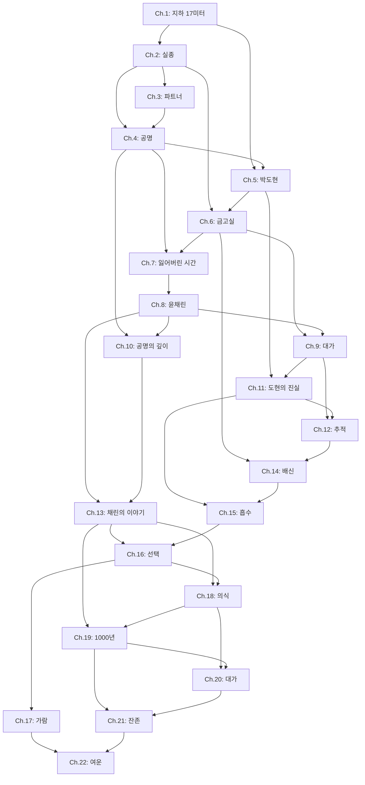

# 잔향 (가제) — 목차

## Part 1: 잔상 (동조의 시작)

### Chapter 1: 지하 17미터
- **Hook:** 양자컴퓨팅 연구소 지하 굴착 현장에서 비정질 유물이 발견된다. 작업자 하나가 유물에 손을 댄 채 의식을 잃는다.
- **Key Concepts:** 유물 발견, 양자 연구소, 최초의 접촉
- **Word Target:** 3,500자
- **POV:** 한서연 (수사관으로서 현장 투입)
- **Dependencies:** 없음

### Chapter 2: 실종
- **Hook:** 동조자로 분류된 첫 피해자가 보호 시설에서 사라진다. 서연이 특수수사관으로 배정된다.
- **Key Concepts:** 동조자, 보호 시설(금고실), 특수수사 배정
- **Word Target:** 3,500자
- **POV:** 한서연
- **Dependencies:** Ch.1

### Chapter 3: 파트너
- **Hook:** 이가람이 서연의 파트너로 배치된다. 두 사람은 첫 수사를 시작한다.
- **Key Concepts:** 이가람 캐릭터 도입, 수사팀 구성
- **Word Target:** 3,000자
- **POV:** 한서연
- **Dependencies:** Ch.2

### Chapter 4: 공명
- **Hook:** 서연이 두 번째 실종 동조자의 방에서 유물 파편을 발견하고, 손이 닿는 순간 환청이 들린다.
- **Key Concepts:** 서연의 잠재 동조 각성, 기억 파편 첫 등장
- **Word Target:** 4,000자
- **POV:** 한서연
- **Dependencies:** Ch.2, Ch.3

### Chapter 5: 박도현
- **Hook:** 연구소 소장 박도현을 심문한다. 그는 유물에 대해 알면서도 알려하지 않는다.
- **Key Concepts:** 박도현 캐릭터 도입, 유물의 비과학적 특성 암시
- **Word Target:** 3,500자
- **POV:** 한서연
- **Dependencies:** Ch.1, Ch.4

### Chapter 6: 금고실
- **Hook:** 서연과 가람이 동조자 보호 시설을 방문한다. 시설 내부는 감옥과 요양원 사이 어딘가다.
- **Key Concepts:** 금고실 실상, 동조자들의 증상, 사회적 통제 메타포
- **Word Target:** 3,500자
- **POV:** 한서연
- **Dependencies:** Ch.2, Ch.5

### Chapter 7: 잃어버린 시간
- **Hook:** 서연이 자신의 어린 시절 기록을 조사한다. 5세 이전 기록이 존재하지 않는다.
- **Key Concepts:** 서연의 과거 미스터리, 기억 소실의 개인적 연결
- **Word Target:** 3,500자
- **POV:** 한서연
- **Dependencies:** Ch.4, Ch.6

## Part 2: 잔향 (진실로의 하강)

### Chapter 8: 윤채린
- **Hook:** 세 번째 실종 사건 현장에서 한 여자가 서연을 부른다. 서연은 그 이름을 알고 있었다.
- **Key Concepts:** 윤채린 첫 등장, 서연의 기억 속 인물
- **Word Target:** 4,000자
- **POV:** 한서연
- **Dependencies:** Ch.7

### Chapter 9: 대가
- **Hook:** 동조자 한 명이 발견된다 — 살아있지만 자아가 붕괴한 상태. 서연은 동조의 대가를 목격한다.
- **Key Concepts:** 기억 소실의 극단적 사례, 흡수(Convergence) 암시
- **Word Target:** 3,500자
- **POV:** 한서연
- **Dependencies:** Ch.6, Ch.8

### Chapter 10: 공명의 깊이
- **Hook:** 서연이 유물 파편에 다시 접촉한다. 이번엔 환청이 아닌 환영 — 어린 자신의 모습이 보인다.
- **Key Concepts:** 동조 심화, 과거 기억의 단편적 회상
- **Word Target:** 4,000자
- **POV:** 한서연
- **Dependencies:** Ch.4, Ch.8

### Chapter 11: 도현의 진실
- **Hook:** 도현이 마지못해 연구 기록을 공개한다. 유물의 물질 분석 결과는 '존재하지 않는 원소'였다.
- **Key Concepts:** 유물의 비정질 본질, 도현의 갈등 심화
- **Word Target:** 3,500자
- **POV:** 한서연
- **Dependencies:** Ch.5, Ch.9

### Chapter 12: 추적
- **Hook:** 실종 동조자들의 공통점을 발견한다 — 모두 같은 날, 같은 시간에 유물에 반응했다.
- **Key Concepts:** 수사 전환점, 연관성 발견
- **Word Target:** 3,500자
- **POV:** 한서연
- **Dependencies:** Ch.9, Ch.11

### Chapter 13: 채린의 이야기
- **Hook:** 채린이 서연에게 말한다. "너는 원래 우리 편이었어." 서연의 잃어버린 기억 속 진실이 흔들린다.
- **Key Concepts:** 채린의 정체, 서연의 과거 재구성
- **Word Target:** 4,000자
- **POV:** 한서연
- **Dependencies:** Ch.8, Ch.10

### Chapter 14: 배신
- **Hook:** 금고실 내부에서 동조자 한 명이 의식을 잃고 쓰러진다. 내부에 누군가가 작업하고 있다.
- **Key Concepts:** 내부자 범죄 가능성, 신뢰의 균열
- **Word Target:** 3,500자
- **POV:** 한서연
- **Dependencies:** Ch.6, Ch.12

### Chapter 15: 흡수
- **Hook:** 유물이 빛난다. 반경 2km 내 동조자 전원이 동시에 통증을 호소한다. 각성이 시작되었다.
- **Key Concepts:** 각성 현상, 흡수의 시작
- **Word Target:** 4,000자
- **POV:** 한서연
- **Dependencies:** Ch.11, Ch.14

## Part 3: 잔존 (기억의 끝에서)

### Chapter 16: 선택
- **Hook:** 서연에게 선택지가 주어진다. 동조를 끊고 기억을 지키거나, 끝까지 가서 진실과 함께 자아를 잃을 것.
- **Key Concepts:** 핵심 갈등 구현, 기억 vs 진실
- **Word Target:** 3,500자
- **POV:** 한서연
- **Dependencies:** Ch.13, Ch.15

### Chapter 17: 가람
- **Hook:** 가람이 서연의 변화를 감지하고 대치한다. 서연은 그에게 진실을 말할 수 없다.
- **Key Concepts:** 가람의 갈등 정점, 인간관계의 균열
- **Word Target:** 3,500자
- **POV:** 한서연
- **Dependencies:** Ch.16

### Chapter 18: 의식
- **Hook:** 채린의 안내로 유물의 원래 위치 — 지하 깊은 곳의 고대 제단에 도달한다.
- **Key Concepts:** 고대 의식의 매개체로서의 유물 본질, 공간적 절정
- **Word Target:** 4,000자
- **POV:** 한서연
- **Dependencies:** Ch.13, Ch.16

### Chapter 19: 1000년
- **Hook:** 채린이 말한다. "나는 천 년째야." 그녀는 첫 각성 때 흡수되었다가 풀려난 의식의 잔재였다.
- **Key Concepts:** 채린의 진정한 정체, 1000년 주기의 의미
- **Word Target:** 3,500자
- **POV:** 한서연
- **Dependencies:** Ch.13, Ch.18

### Chapter 20: 대가
- **Hook:** 서연이 완전한 동조에 돌입한다. 잃어버린 기억이 몰려오지만, 현재의 기억이 빠져나간다.
- **Key Concepts:** 기억 소실 절정, 정체성 해체
- **Word Target:** 4,000자
- **POV:** 한서연
- **Dependencies:** Ch.18, Ch.19

### Chapter 21: 잔존
- **Hook:** 서연은 유물을 파괴할 수 없다. 대신 자신의 의식을 담보로 각성을 지연시킨다.
- **Key Concepts:** 희생, 잔존의 의미
- **Word Target:** 4,000자
- **POV:** 한서연
- **Dependencies:** Ch.19, Ch.20

### Chapter 22: 여운
- **Hook:** 1년 후. 가람이 병원을 방문한다. 서연은 가람을 알아보지 못하지만, 웃는다.
- **Key Concepts:** 결말, 기억과 정체성의 여운
- **Word Target:** 3,500자
- **POV:** 한서연 → 이가람 (마지막 장면)
- **Dependencies:** Ch.17, Ch.21

## Cross-Chapter Dependencies

